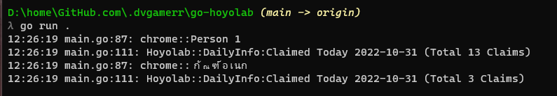

# Hoyolab Daily Checkin

Genshin Impact's Hoyolab Daily Check-in Bot is here!. You only need to run it once, then it will continue to run forever.

## How to use
1. Open chrome browser open [https://www.hoyolab.com/home](https://www.hoyolab.com/home)
2. Login user genshin account for daily cliams.
3. run `hoyolab.exe`.
4. If found Error please craete issues in [https://github.com/dvgamerr/go-hoyolab/issues](https://github.com/dvgamerr/go-hoyolab/issues)

## Features

- [x] cliams checkin daily with chrome session.
- [x] all profile chrome session.
- [ ] install schedule task with windows-os automatic.
- [ ] command line `hoyolab` support all os.
- [ ] support session with all browser.
- [ ] docker container support

## Prerequisites
- Windows OS
- Have login to mihoyo's website at any browser (A login for a year is enough)

## License
MIT © Touno™
