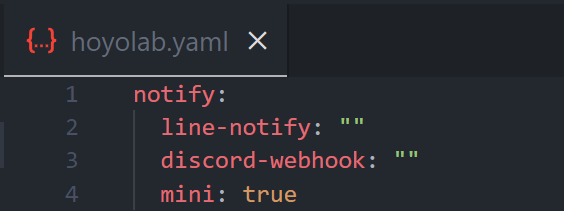

  <h1>Hoyolab a Daily Check-in for Hoyoverse Game</h1>
  

    
    
    
    
    
  

  
Genshin Impact, Honkai StarRail, Honkai Impact 3. You only need to run it once, then it will continue to run forever.

## Features
- [x] Line Notify support after checkin.

  

  
  
- [x] Claims checkin daily with chrome browser only.
- [x] Multiple chrome profiles for multiple game accounts.

  
  
- [x] Genshin Impact claims support.
- [x] Honkai StarRail claims support.
- [x] Honkai Impact 3 claims support.

### Todo
- [ ] update new version from github automatic.
- [ ] docker container support.
- [ ] support session with all browser.
- [ ] command line `hoyolab` support all os.
- [ ] install schedule task with windows-os automatic.

---

## How to use
1. Open chrome browser open [https://www.hoyolab.com/home](https://www.hoyolab.com/home)
2. Login user genshin account for daily cliams.
3. run `hoyolab.exe`.
4. If found Error please craete issues in [https://github.com/dvgamerr/go-hoyolab/issues](https://github.com/dvgamerr/go-hoyolab/issues)
5. If Notify message after CheckIn use [LINE-Notify](https://notify-bot.line.me/my/)
6. log in that and `Generate token` in below page after that copy token paste in `hoyolab.yaml` in `notify.token` at `XXXXXX` same image:
 
 
  
7. If you don't play some game add `#` in first char in line scope, e.g. i don;t play honkai impact 

  

### Windows
### Solution If Turn On computer 24*7
- use `Task Scheduler` and `Create Basic Task`
- select `Daily` next time at `5 am`.
- after click Next select `Start a program`, Next and browse `hoyolab.exe`

### Solution If starup computer 
- create shortcut from `hoyolab.exe`
- copy shortcut to `C:\ProgramData\Microsoft\Windows\Start Menu\Programs\Startup`

### MaOcOS & Linux
- use `crontab` for automatic run.

## Prerequisites
- Have login to mihoyo's website at chrome browser (A login for a year is enough)

## If you need help You can join Discord.

