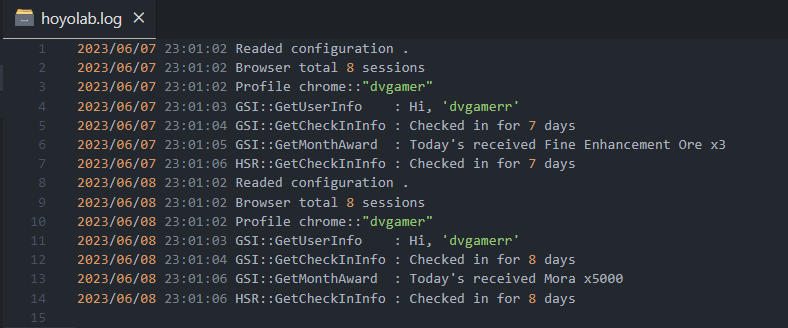
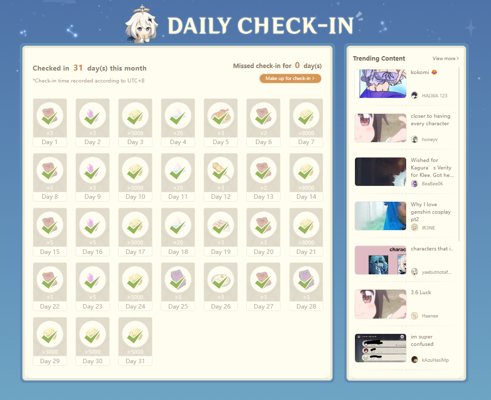
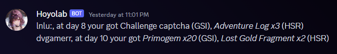

  <h1>แอป Check-in อัตโนมัติสำหรับ Hoyoverse Game</h1>
  

    
    
    
     
    
    
    
  

  
<a href="./README.md">English</a> | <a href="./README_TH.md">ภาษาไทย</a>

  
Genshin Impact, Honkai StarRail, Honkai Impact 3. You only need to run it once, then it will continue to run forever.

## Features
- [x] ปล่อย version ใหม่ผ่าน github actions.
- [x] เริ่มต้นใช้งานได้แค่ chrome เท่านั้น.
- [x] สามารถใช้กับ chrome หลายโปรไฟล์ เพื่อใช้กับหลาย login ID ได้.
- [X] สามารถรัน `hoyolab` ได้ทุก os.
- [x] แจ้งเตือนผ่าน Line Notify.

  

  

- [x] แจ้งเตือนผ่าน discord webhook.

  
  
- [x] รับรองเกม Genshin Impact.
- [x] รับรองเกม Honkai StarRail.
- [x] รับรองเกม Honkai Impact 3.

### ที่จะทำต่อ
- [ ] รองรับ Zenless Zone Zero.
- [ ] docker container support.
- [ ] support session with all browser.
- [ ] install schedule task with windows-os automatic.

---

## วิธีใช้
1. เปิด chrome ขึ้นมาแล้วเข้าเว็บ [https://www.hoyolab.com/home](https://www.hoyolab.com/home)
2. เข้าใช้งาน ด้วย account ของ hoyoverse ที่ต้องการจะรับรางวัน.
3. เปิดโปรแกรม `hoyolab.exe` ขึ้นมา เสร็จ.
4. ถ้าพบ error แจ้งได้ที่  [https://github.com/dvgamerr/go-hoyolab/issues](https://github.com/dvgamerr/go-hoyolab/issues)
5. ถ้าต้องการ ใช้แจ่้งเตือนให้เข้่าไปที่ [LINE-Notify](https://notify-bot.line.me/my/)
6. เข้าใข้งานแล้ว กด `Generate token` จะได้ token มาแล้ว copy มาวางไว้ใน `hoyolab.yaml` ที่ `notify.token` แทนที่ `XXXXXX` ตามรูป:
 
 
  
7.ถ้าเกมไหน ไม่ได้เล่นให้ลบ หรือ `#` เพื่อปิดไปได้เลยตามรูป

  

### Windows
### สำหรับเครื่องที่เปิดเครื่อง 24 ชม ให้สร้าง Task Schedule ตามนี้ (แนะนำให้ใช้ profile อื่นเพื่อแทน profile หลัก)
- เปิด `Task Scheduler` คลิก `Create Basic Task`
- เลือก `Daily` แล้วกด next เลือกเวลาเป็น `5 am`.
- หลังจากกด Next ให้เลือก `Start a program`, กด next และเลือก browse ไปหาไฟล์ `hoyolab.exe` ในเครื่อง

### สำหรับเครื่องที่เปิด-ปิดทุกๆ วัน
- สร้าง shortcut จากไฟล์ `hoyolab.exe`
- แล้ว copy ไปวางไว้ที่ `C:\ProgramData\Microsoft\Windows\Start Menu\Programs\Startup`
- ทุกวันที่เปิดเครื่องมันจะ checkin ให้ ตลอด 

### MaOcOS & Linux
- ใช้ `crontab` ได้เลย ง่ายกว่าเยอะ.

## Prerequisites
- เข้าสู่ระบบเว็บไซต์ของ mihoyo ด้วยเบราว์เซอร์ Chrome

## หากคุณต้องการความช่วยเหลือ คุณสามารถเข้าร่วม Discord ได้
#### (อย่าเที่ยวพิมพ์ @everyone แล้ว โวยวายเป็นเด็กๆ อธิบายดีๆ เด๋วมาตอบ)

